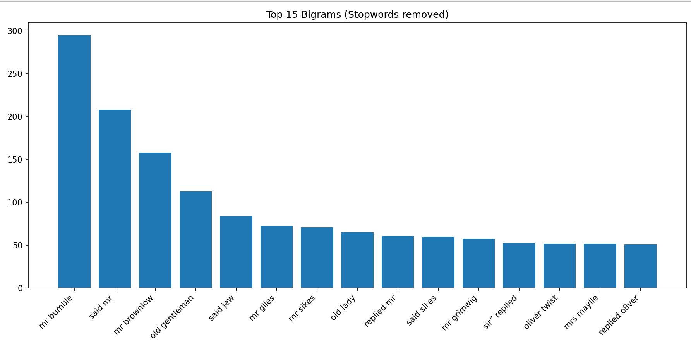
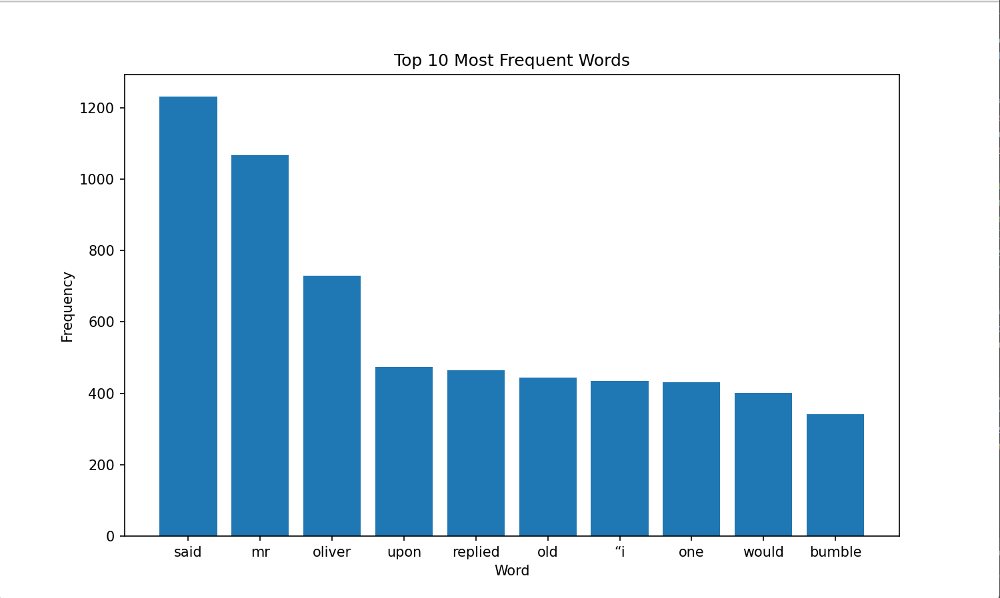

# Text-Analysis-Project

1. Project Overview 

I used the Gutenberg Projects "Frankenstein; Or, The Modern Prometheus by Mary Wollstonecraft Shelley". I manipulated the data in order to extract the top words used in the book in order to find out what words may have made Frankenstein such a novel book in its time and the precedent for so many horror movies to follow it. Considering how genre defining it is (aswell as being one of my favorite books) I felt that it was an interesting subject for analysis. For my main analysis I found the general most used words and then used concordance to find out the most common sentences that used those words. It was interesting to find that the most common usages of the most common words were names and speech, which is most likely due to the presense of letters and conversations as the main form of plot/story beats. I used bigrams and trigrams as a primary step after finding the top words. 

Figure Generated:

Implementation
Get & Clean Text: Used urllib.request to download the file. Cut off the Gutenberg header and footer. Trim spaces.
Prepare Words: Lowercase the text, remove punctuation, split into words, and remove English stop words with NLTK.
Counts & Stats: Count words with Counter. Show the top words. Compute average word length, average sentence length (simple split on periods), and vocabulary richness (unique words ÷ total words).
Charts: Plot the top 10 words with Matplotlib.
Concordance: Split text into sentences and build a map of word → sentence indexes. A helper prints a few sentence matches for any word.
Collocations: Build bigrams and trigrams from the filtered words, count them, print the top ones, and plot top bigrams.

Results (what you’ll see)
A list of the most common words (after removing stop words).
Basic stats: average word length, average sentence length (rough), and vocabulary richness.
A bar chart of the top 10 words.
Optional concordance lines for a search term (e.g., “whale”).
Top bigrams/trigrams plus a bigram chart.

Notes
The sentence split is simple, so abbreviations can throw it off.
NLTK’s default stop-word list is used.
Make sure import re is present so the regex split works in Section 6.